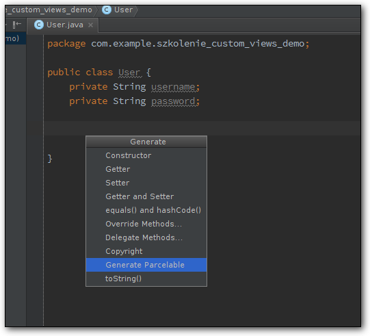

# IntelliJ/Android Studio Plugin for Android Parcelable boilerplate code generation

This tool generates an Android [Parcelable](https://developer.android.com/reference/android/os/Parcelable.html) implementation based on fields in the class.

## Installation

 Plugin is uploaded to plugin repository.
 If you like, you can install it manually:

 0. Download `ParcelableGenerator` [release](https://github.com/mcharmas/android-parcelable-intellij-plugin/releases/tag/v0.7.0)
 0. Open IntelliJ/Android Studio
 0. *Preferences* -> *Plugins* -> *Install plugin from disk...*.
 0. Choose the downloaded jar file

## Usage

Just press **ALT + Insert** (or your equivalent keybinding for code generation) in your editor and select **Parcelable**. It allows you to select the fields to be parceled.



## Supported parcelable types

 * Types implementing Parcelable
 * Custom support (avoids `Serializable`/`Parcelable` implementation) for: `Date`, `Bundle`
 * Types implementing Serializable
 * List of `Parcelable` objects
 * Enumerations
 * Primitive types: `long`, `short`, `int`, `float`, `double`, `boolean`, `byte`, `String`
 * Primitive type wrappers (written with `Parcel.writeValue(Object)`): `Short`, `Integer`, `Long`, `Float`, `Double`, `Boolean`, `Byte`
 * Primitive type arrays: `boolean[]`, `byte[]`, `char[]`, `double[]`, `float[]`, `int[]`, `long[]`
 * List type of any object (**Warning: validation is not performed**)
 * Map support — **Note: this implementation always assumes `HashMap` is desired**
 * SparseArray support

## TODO

 * Validation of List arguments
 * Display warning about not serialized fields
 * Active Objects support (Binders and stuff)
 
## Contributors

 * [Michał Charmas](https://github.com/mcharmas/)
 * [Dallas Gutauckis](http://github.com/dallasgutauckis)

## License

```
Copyright (C) 2015 Michał Charmas (http://blog.charmas.pl)
Copyright (C) 2015 Dallas Gutauckis (http://dallasgutauckis.com)

Licensed under the Apache License, Version 2.0 (the "License");
you may not use this file except in compliance with the License.
You may obtain a copy of the License at

     http://www.apache.org/licenses/LICENSE-2.0	     

Unless required by applicable law or agreed to in writing, software
distributed under the License is distributed on an "AS IS" BASIS,
WITHOUT WARRANTIES OR CONDITIONS OF ANY KIND, either express or implied.
See the License for the specific language governing permissions and
limitations under the License.
```
